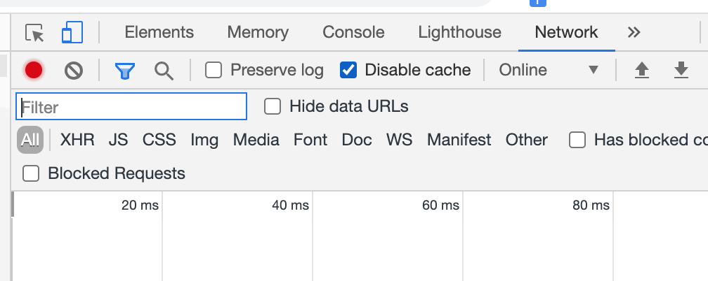
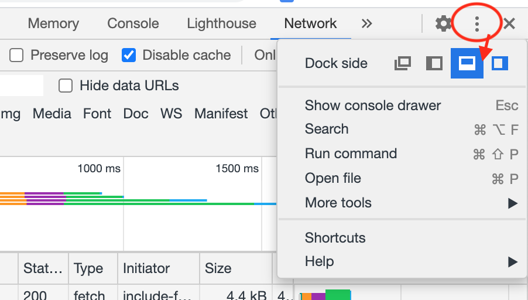

LAB: F5 Essential App Protect with CloudFront & Multi-Region App (ISC)
======================================================================

.. contents:: Table of Contents

Background & Scenario
#####################

Your "Organization"
*******************

You oversee application delpoyment within your organization. One of these apps is BuyTime Auction: a modern microservices-based written in React.JS and running on NGINX. It was built by an outsourced team in record speed, which raised some questions on whether "proper" security testing has been done. You don't have time, resources, or in-house expertise to put the app through rigorous test.

Your team is piloting F5 Essential App Protect and is confident it can provide the checkbox-simple security for your org. For example, you like the built-in protection across a number of vectors, which is a useful "isurance policy" for the unknowns that potentially exist any time you leverage many frameworks in the modern app dev approach.

However, you think Essential App Protect is a game-changer for the BuyTime project because of the following 2 capabilities:

- caching capability offered by intergrated AWS CloudFront feature of this innovative cloud-based WAF (and you're serving a global audience!)
- easily adding additional app instances without any need to re-configure multi-region protection!

Your "Mission"
*******************

Your team has already done a bunch of work ahead of time:

- deployed an instance of F5 Essential App Protect to protect the dev/test BuyTime Auction app instance;
- configured the CNAME update for the dev/test app;
- set the protection for the app to be configured in *Monitoring mode during dev/test*, 
- sent you an invite to the ORG (ISC-LAB-$$$, where $$$ is your unique ID... more on that below).

Unforuntatley, the protected app as well as the instance of Essential App Protect service just happen to be both be deployed in a region far... far... away... from you. But no worries, you decided to take of advantage of this situation to run through a series of tests (i.e. the Lab).

1) Give the protected app instance a quick test with a SQL injection statement. Change from Monitoring to Blocking mode and try again to compare results.
2) Do a baseline test of latency for the unprotected app instance (directly hitting the server IP from your browser)
3) Purge cache for the protected instance, and then test latency of the protected instance + compare those results to the latency of the unprotected instance
4) Add another app instance into the configuration of Essential App Protect + test to see if the app is now served from that new app instance
5) Compare latency for the final configuration to see how all of the different configuration options fare against one another.

You're all excited and ready to go... Let's do this!!

Pre-Requisites
###############

- Main browser: any modern browser (Chrome recommended) for working with the UI (and this lab)

In order to use F5 Essential App Protect you need access to F5 Cloud Services and be logged in with a valid user account. If you need to sign up, or if you already have one, use your Main browser to log into the `F5 Cloud Services portal <http://bit.ly/f5csreg>`_.

.. figure:: https://github.com/f5devcentral/f5-cloudservice-eap-lb-lab/raw/master/_figures/0_1.png

You can use use AWS CloudFront directly from F5 Essential App Protect, no additional accounts required. 

Running the Lab
###############

1. Getting started with the Lab Environment
************************************************************************

`a)` In your email, accept the invite that was sent you for this lab. Note the unique ID for the Organization (ISC-Lab-$$$) that you were asked to join, where $$$ will be your own personalized ISC Lab Organization ID (Org ID). Take note of this Org ID, you will need it later. 

.. figure:: _figures/invite.png

`b)` Inside your main browser F5 Cloud Services Portal and click on the username icon in the top right corner and switch account to the ISC-Lab-$$$ created personally just for you with your Org ID.

.. figure:: _figures/switch_account.png

`c)` Go to the Essential App Protect tab and find your application. We have pre-created one for you. The application name is isc-lab-$$$.securelab.online where $$$ is your unique id.

.. figure:: _figures/open_the_app.png

2. Run a SQL Injection Attack
************************************************************************

Alright. Now you want to "kick the tires" on the app, to see just how poorly it may have been coded. You're thinking why not try a SQL Injection attack first, which inserts a SQL query via the input data field in the web application. Such attacks could potentially read sensitive data, modify and destroy it. More detailed information can be found `here <https://bit.ly/2ZUv0Xl>`_.

Let's now follow the steps below to send a SQL Injection attack via browser to our "BuyTime Auction" app. 

`a)` Copy your FQDN from the F5 Cloud Services Portal. You can get to your app protection settings by clicking "Protect Application" menu in the top middle of the EAP dashboard; the FQDN is located under "General Tab" => "Application Details". You will be using this FQDN for the next task as well, so take note of it and also the IP address of the server where your app is deployed. Also take note of the AWS Region for your deployed app -- it should be far from you geographically, and this will become important in Step 2. But before we that, let's get attackin'!

Paste the FQDN into your browser (http://yourdqn). The BuyTime auction site should load, served up by the NGINX app instance that you are currently protecting. You can explore around a bit here.

Next, in the **LOG IN** window let's attempt a SQL Injection attack by filling in username value as follows (including single quotes) **' OR 1=1 --'** and use any password as the value. *NOTE the space after --, it's needed for the attack*. Click **LOGIN**.

.. figure:: _figures/sql_attack_not_blocked.png

As you can see this attack bypassed the login and is showing the contents of the catalog that should be restricted only to valid users. Not good! 

But, no worries! This app has already been configured with F5 Essential App Protect, and you know that all you need to do is to turn on the Blocking mode on. Let's do this now.

`b)` Go back to the F5 Cloud Services Portal, the **High-risk Attack Mitigation** tab and toggle **Blocking Mode** on.

.. figure:: _figures/sql_attack_turn_on.png

`c)` And now simulate the attack again by repeating the step **a)** above. This time it will be blocked by Essential App Protect.

.. figure:: _figures/sql_attack_blocked.png

You can find detailed event log in the events stream in the F5 Cloud Services Portal, the **VIEW EVENTS** card. 

.. figure:: _figures/sql_attack_events_stream.png

Note that if, instead of the FQDN, you used the IP address of the server, then your browser requests would bypass EAP. That is why it's so important for EAP customers to block access for IPs other than those used by the EAP service in the region(s) deployed. You can find out more about the allow list for EAP here:  https://clouddocs.f5.com/cloud-services/latest/f5-cloud-services-Essential.App.Protect-WorkWith.html#add-deployment-regions-to-allow-list

3. Baseline Test of Latency Against the App Server (using direct IP)
************************************************************************

`a)` The next couple of tests will compare latency without and with Essential App Protect + CloudFront. In your browser window ( Chrome recommended), open "Developer Tools" by going to "View" => "Developer" => "Developer Tools". Select "Network" tab. In alternative browsers find the equivalent of the Network tab. Make sure "Preserve Log" is unchecked and "Disable Cache" is checked as in the image below.

We recommend that you also Dock the developer tools to the Bottom of your browser, because you will be opening another window 
side by side in order to run a comparison of latency of both of your sites. 

`b)` So, at this point open another window and make sure the Network tab is also selected there. Now that you have both browsers open, enter the IP address of your first deployed instance into one window, and the FQDN of the site into the other; both of these data points should have been noted in the step 2a above. 

When you hit Enter, wait for the site to load and then take note of the total time it took to load each site. You'll be looking for the value in "Finish: [ ] ms/s". Now, recall that your initial app instance is deployed on an AWS Region far from you geographically. This means that more than likely your Direct IP test should yield a relatively high latency result (of course, this depends on your internet connectivity as well, but we expect it to be at least 7-10 seconds).  

.. figure:: _figures/side_by_side_america.png

`c)` At ths same time, the site with the FQDN URL would is going through AWS CloudFront, which means the cached content such as images and static elements are being served from a regional Edge CDN Point of Presence (PoP) closer to you. This means that most likely the site requested through the FQDN in your browser window is loading faster, on average as much as 6x - 10x faster, than the one you're calling directly by the application IP. 

This is the key value of the Essential App Protect integration with AWS CloudFront: the ability to deliver content to a global user base of protected applications with very little configuration, done right inside the EAP portal. Score!

4. Adding an Additional Region Endpoint
************************************************************************

Alright, now that we've done our first baseline test let's go on to explore the second value of running AWS CloudFront with Essential App Protect: the ability to easily add additional application endpoints (app regions) without the need to re-confgure or apply any additional configuration to the new region. Everything is done for you! 

Back in the F5 Essential App Protect portal, take note of the "Deployed Region" in the General Tab of the EAP portal (to get there, you just need to click the "Protect Application" menu of the main dashboard). You should have the initial region for the currently deployed EAP instance indicated, with the IP application of the only app instance that we are protecting. 

.. figure:: _figures/first_instance_ip.png

Notice in the example here, our app only has only one endpoint with the EAP instance deployed to in US East N. Virginia (of course your regions will probably be different). BuyTime auction is intended to serve a global audience, and while AWS CloudFront is effectively distributing **some** content of our site to our target audiences -- it's mostly the **static** stuff like images. It would be a **really** good idea to have another app instance or more for each of the target regions where we'd like to have presence. 

Imagine, if we know we have customers in Europe and Asia, but only one app instance in North America.... that would mean all of the **dynamic** interactions with the database, for eample, is still hapenning on that one app instance far... far.. away, and your customers' experience would be subpar! 

No worries, F5 Essential App Protect makes it super easy to add a second endpoint, and to have EAP automatiically apply all of the config such as protection policy and AWS CloudFront configuration. You will now go ahead and add another app endpoint, which should be much closer geographically to where you are located (it's a neat thing we built into this lab). So let's do this!

`a)` Go to the F5 Cloud Services Portal, the **PROTECT APPLICATION** card. There, under the **General** tab and in the **Description** field you will can find information for the second app instance IP address and the **required AWS region** of where you should deploy your second Essential App Protect region.

*NOTE: In our example below the required second endpoint needs to be located in Europe in **eu-west-3**. We ask that you please select the region you were assigned indicated in his description, because selecting a different AWS deployment region **can impact capacity and therefore customer experience**. So let's do the right thing and select the right region, right? Of course, your second app IP and Region are likely to be different, as what you see below is just an example.*

.. figure:: _figures/info_in_description.png

`b)` Select **Manage regions**.

.. figure:: _figures/manage_regions.png

`c)` Hit **Add** to add the new region:

.. figure:: _figures/add_region.png

`d)` Fill in the region details with the information found in the **Description** field above and **Save** the settings.

.. figure:: _figures/add_region_details.png

The application will be deployed to the second region. Now, the routing of traffic happens based both on Latency *and* availability of the endpoint. That means there's still a chance the app instance far away may be used just because the closer one was busy. However, most of the time you will probably get the 2nd region if it is indeed closer to you geographically.

It will take several minutes to complete, and during this time we will do a quick journey through some useful new features of the Essential App Protect and let the configuration do its thing.

.. figure:: _figures/add_region_deploying.png

5. A Quick Run-through a Few of the New Features in Essential App Protect (while we wait)
*****************************************************************************************

While our second region endpoint is deployed let's have a quick look at the following features: 

`a)` Under "General" => "Caching", click **Manage Caching**. Let's have a look at all of the conifguration options that have been configured initially for our application. Note the following:

- **EdgeTiers**: geographies that we chose to support for caching of our application. Because we're serving a global audience, we picked EdgeTier 3.
- **Forward Request Headers**: this is where we select which Headers and Cookies to enable for forwarding, as well as enabling compression.
- **Invalidation Purge**: Finally, a useful feature which deletes content from cache across all EdgeTier locations based on the path(s) specified. Example: */images/**  We will do a quick cache purge shortly, not now, because, why not?!

**TO DO: ADD SCREENSHOT**

`b)` Now, next to the status: "Deployed" on the left-hand-side let's select the link to "View Metrics". This can also be accessed from  "Monitor Application" - on the left side of the pretty map, under "View app data insights". This reporting is a new feature specific to AWS CloudFront: "Caching Metrics".

**TO DO: ADD SCREENSHOT**

As the traffic for our app traverses the data path as configured, we get some really useful stats, which are updated on a regular basis. Also, besides caching metrics we can look at some awesome "Protection Stats" in the other reporting tab, including top attack types, severities, signatures, and URIs impacted (slice this data by different time, for fun).

`c)` Next, in the "General" => "Listener Settings" section, click "Manage Lister Details". Notice the TLS version 1.2, which is a relatively new addition to EAP. Yay!

**TO DO: ADD SCREENSHOT**

`d)` Lastly, under "View Events" - check out all of the "Service-specific" events that are helpful to keep track of what's happening with our service. 

**TO DO: ADD SCREENSHOT**

Alright, at this point have a quick break, get a coffee, stretch, or send your F5 colleague a quick message on how awesome this Lab has been so far (we just want to gave our new region sufficient chance to deploy). That said, let's move on the next and final segment of our journey. 

6. Cache Purge & Latency Tests of the 2nd Region with CloudFront 
************************************************************************

OK, by now that second EAP region should be deployed and configured, and you should see the **Active** state indicator. If not, refresh just to be sure -- and note that in some regions things may just take a bit longer. For example, in our Lab tests us-west-2 (Oregon) took on average 20-25 mins to deploy the second region; by comparison eu-west-3 (Paris) was much faster. 

.. figure:: _figures/add_region_active.png

`a)` Now let's run invalidate some content by running invalidation (purge). You should recall from the last step where this option is located, and what we will do next will all items from the cache in our EdgeTier selections. This is useful for when our site or app has changed (such as a new / updated app build or content like an image). 

Click "Create" for a new Invalidation, then in the path add '/' to indicate that all content will be purged <--- **TBD if correct** and click "Save". This will invalidate the cache. 

**TO DO: ADD SCREENSHOT** 

`b)`

Now let's do one final test of the BuyTime app (using the app FQDN) in the browser. At this point, hopefully, you will see that the app instance has changed to the one much closer to you geographically. 

.. figure:: _figures/region_europe.png

If it didn't, there are some possible things that may have happened to our second (new) app instance:
- it may not have been available/busy, or
- it may have actually been higher latency than the other region.

If the closer app instance/region did load, then YAY!, this lab has not a total waste at this point, right?! Let's just do another quick test for latency just to see whether everything is loading even faster now that a closer app instance is being loaded. 

`c)`

Lets open the Developer tools by pressing Ctrl+Shift+I or From "Browser settings" => "More tools" => "Developer tools". Open the Network tab and disable caching and preserve logs.

.. figure:: _figures/dev_tools.png

If you feel adventurous, open two browser windows. We will try to load both: 
- the app using the FQDN domain name, and 
- the app using the IP address of the 2nd app instance (the one from the Dscription field in step 4.a. 

.. figure:: _figures/side_by_side_europe.png

Try to press page refresh couple times and check the page load time. In the first window with domain name it should be faster (in theory) because the traffic flows through the CloudFront CDN. That said, it's possible the results are really close, or perhaps not what you'd expect. Can you take a guess why? Perhaps AWS-hosted app instance is just loading faster than CDN, perhaps because the PoP is a tad bit slower, or further away from you geographically. Have 

This is a good opportunity to play detective and run some tests, including re-running tests from Step 3b above (the original instance IP vs FQDN). How do those two compare? What is different?

Alright, at this point you've done some pretty incredible work, ran some tests, added another region in EAP, did some cache purging, and ran more tests. Hopefully you had fun?! Either way we'd love to hear about your results and how you liked this lab, as well as any issues or questions you may have. 

What's Next?
###############

Thanks for hanging in there with us in this lab. If you've gotten this far, you've just done some great work with CloudFront from F5 Essential App Protect. Have you looked at any of the othe labs available, or looked at the F5 Essential App Protect Ansible project that automates many of its routine tasks?  Here are some links for you to look at:

* EAP Lab
* EAP / DNS Lab
* Ansible repository

Thanks for taking the time to do this lab, let us know any issues in the Issues section of this repo!
