LAB: Lab description here
==================================================

.. contents:: Table of Contents

1. Accept the invite
************************************************************************
In order to test geo-proximity rules, you can use your own VPN service (if you have one), remote desktop to a VM in a different region (if you have one), or alternatively use the Opera browser.
Open the Opera browser, click Settings, Advanced, Features and then Enable VPN.
.. figure:: _figures/opera_setup.png

Accept the invite we sent to your mail
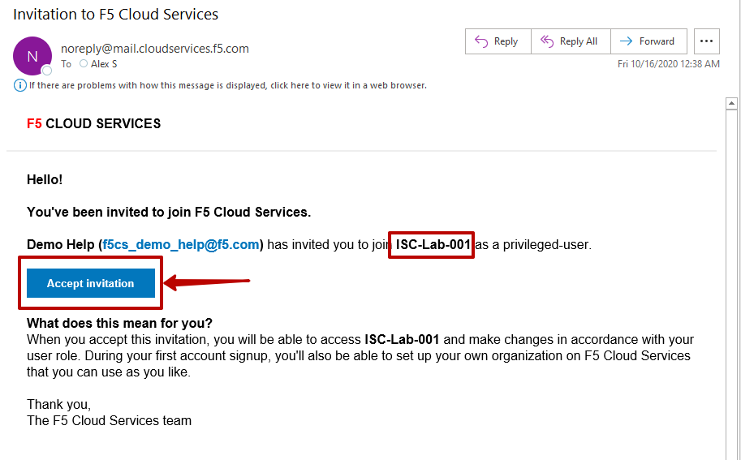

Click on the username icon at the top right corner and switch account to the ISC-Lab-xxx (where xxx is your unique id. you can find it in the invite)
.. figure:: _figures/switch_account.png

Go to the Essential App Protect tab and find your application. We have pre-created it for you. The application name is isc-lab-xxx.securelab.online where xxx is your unique id
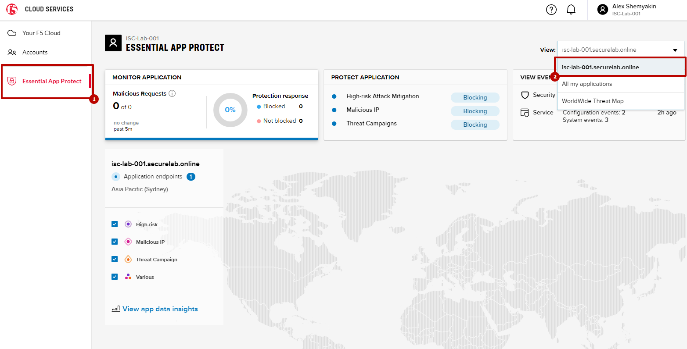

1. Simulate SQL Injection Attack
************************************************************************

SQL Injection attack inserts a SQL query via the input data field in the web application. Such attacks could potentially read sensitive data, modify and destroy it. More detailed information can be found `here <https://bit.ly/2ZUv0Xl>`_.

Let's now simulate SQL Injection attack via browser and our "BuyTime Auction" app. Copy your FQDN from the F5 Cloud Services portal and paste to your browser. In the **LOG IN** window fill in username value as follows (including singls quotes) **' OR 1=1 --'** and use any password as the value. Click **LOGIN**.

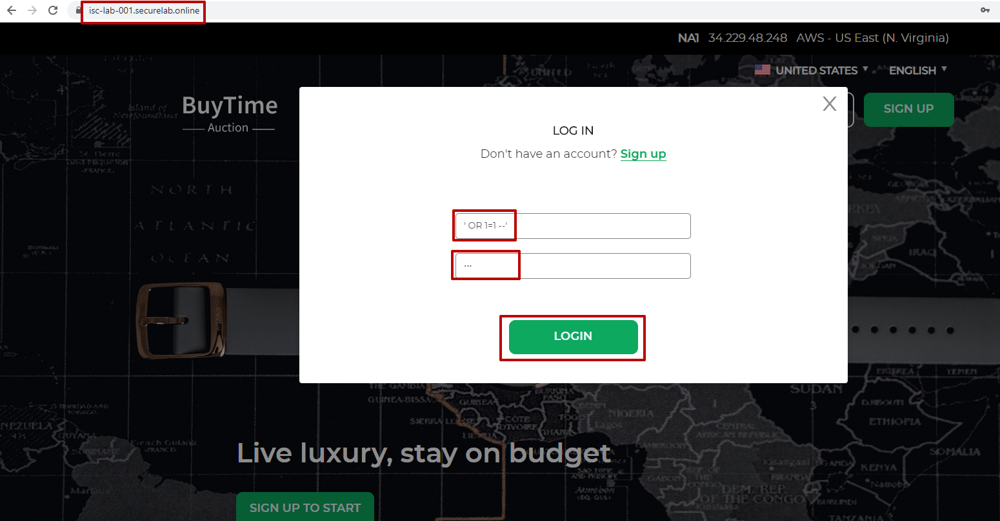

Turn on High-risk Attack Mitigation enforcement in the Blocking mode

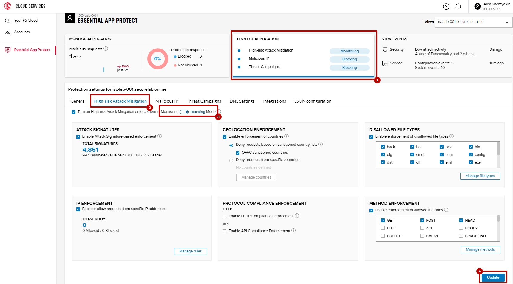

And repeat the attack. Now it will be blocked by Essential App Protect

.. figure:: _figures/sql_attack_blocked.png

Detailed events log you can find in the events stream

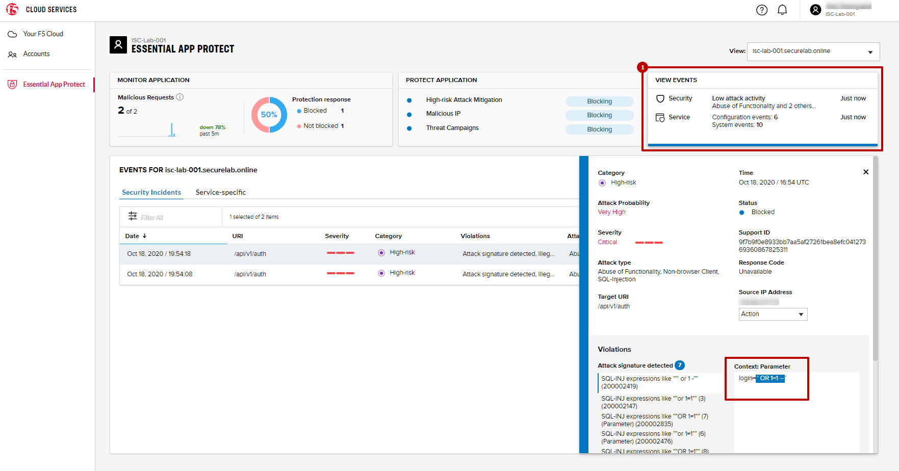

2. Add an Additional Endpoint
************************************************************************

Let's add the second endpoint located in Europe for European users.

In the description field you can find the information required for the second region
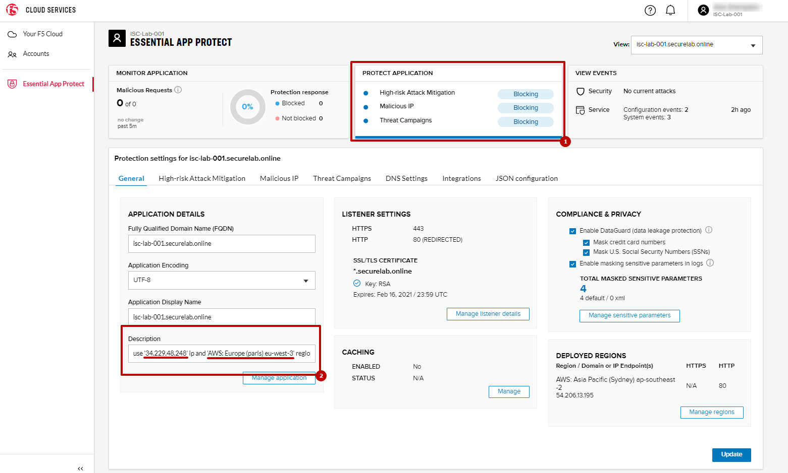

Go to the region details
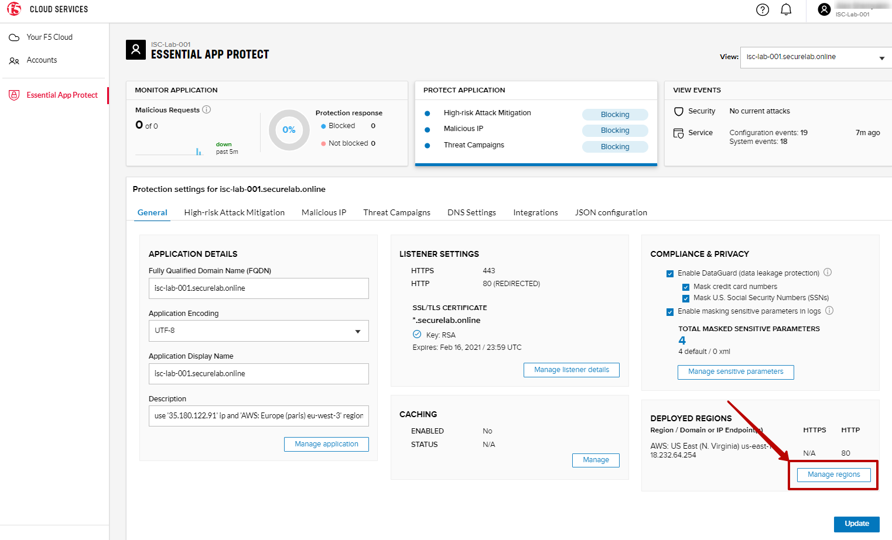

Click add region
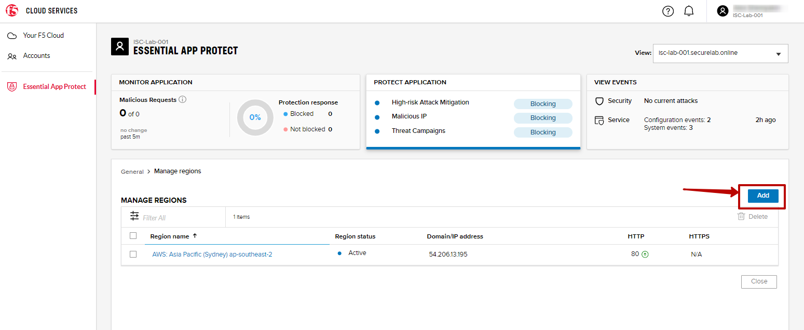

Fill the region details with information found in the description field and click save
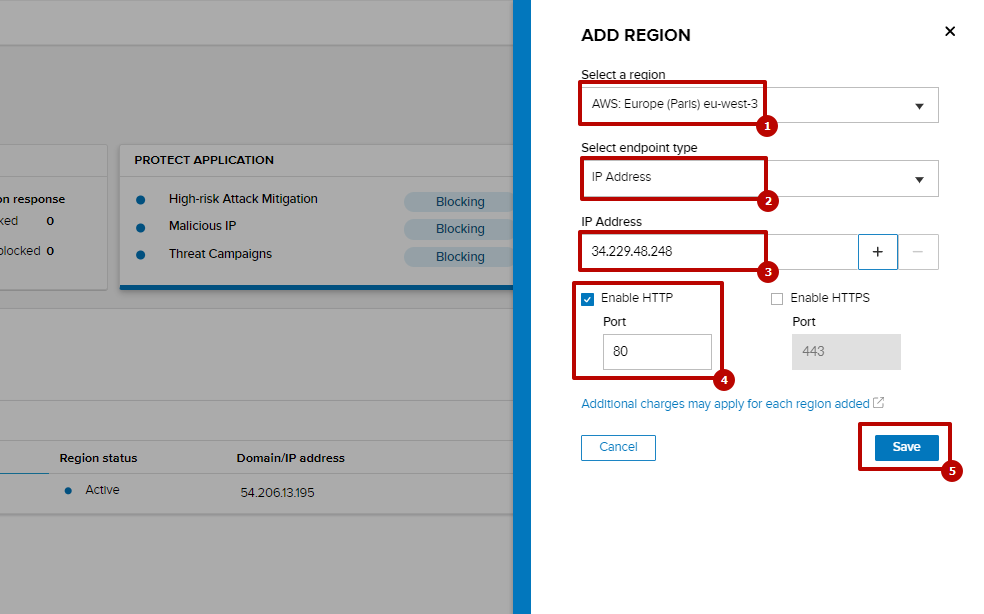

The application will be deployed to the second region. It will take several minutes to complete
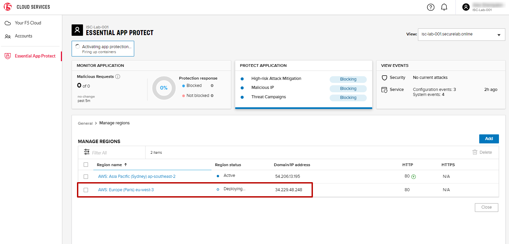

When the app will be deployed you will see an active state indicator
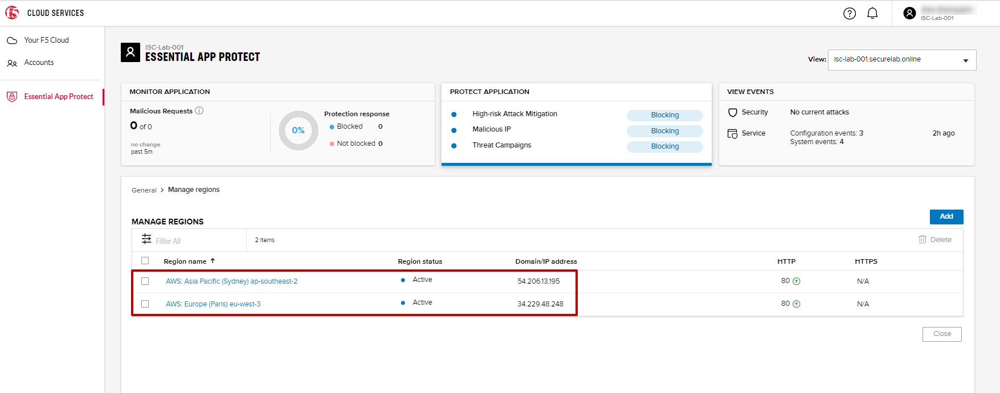

**TODO: UPDATE SCREENSHOT**
You can also track regions on the interactive map
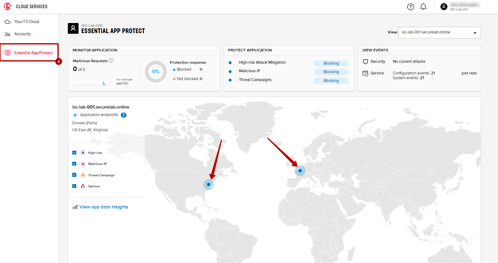

Now let’s test the protected app, as well as the multi-region support using the Opera browser. As you remember, we now have two endpoints for users in North America and Europe, so we'll test those two locations. Keep in mind that Essential App Protect uses performance-based routing to determine the closest endpoint to drive the users to. This means for true geo-proximity based routing it's best to use a service like the `F5 DNS Load Balancing <https://github.com/f5devcentral/f5-cloudservicednslab>`_.

Open the Opera browser, click **VPN** and first select **Americas**. This will simulate your entering the test app (BuyTime Auction) from the America region. Then copy FQDN name in Load balanced record properties and paste into the browser. You will get to that IP endpoint which is located in North America, US East (N. Virginia).

**TODO: UPDATE SCREENSHOT**
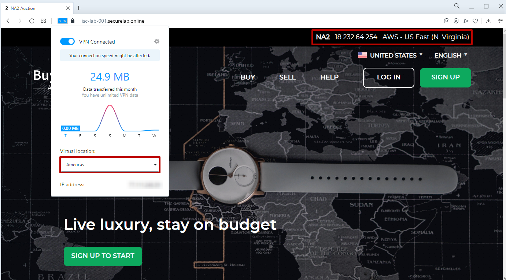

And now select **Europe** in **VPN** of the Opera browser and **Reload** the page. You will get to the European IP endpoint, which means that European users are directed to that IP Endpoint.

**TODO: UPDATE SCREENSHOT**
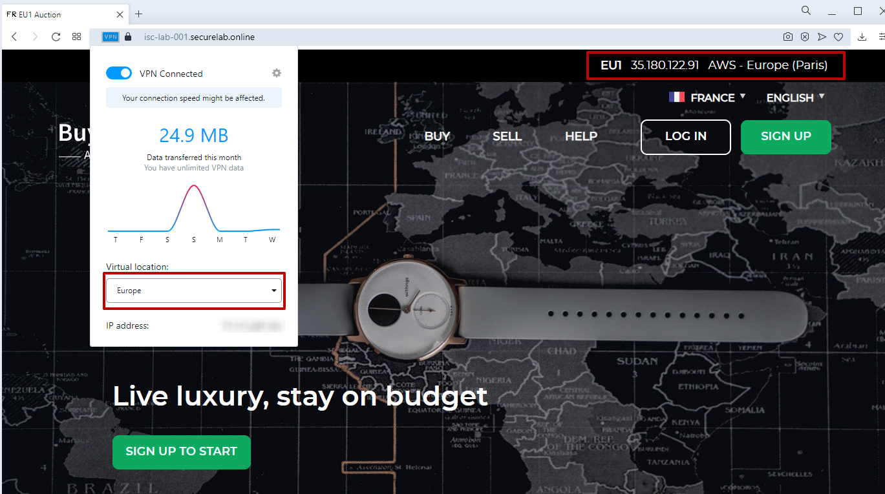

3. Enable CloudFront caching
************************************************************************

Now let's turn on the CloudFront. Go back to the Essential App Protect
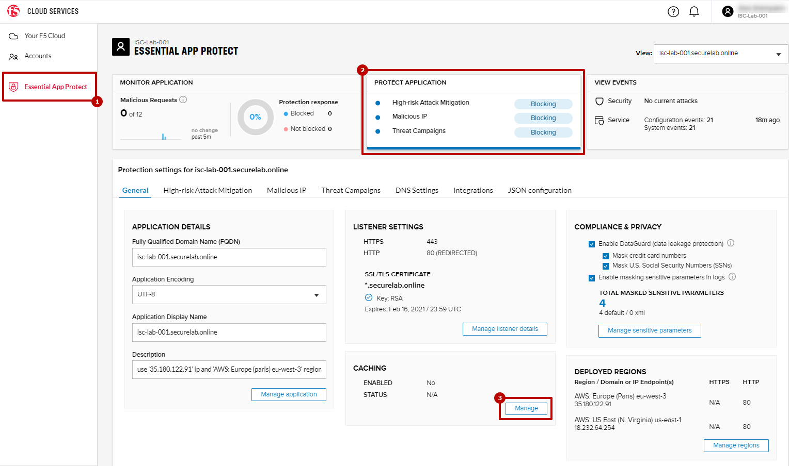

Turn on "caching", select "EdgeTier 3", add "Accept" and "Authorization" headers forwarding, forward "all" cookies and click the update button
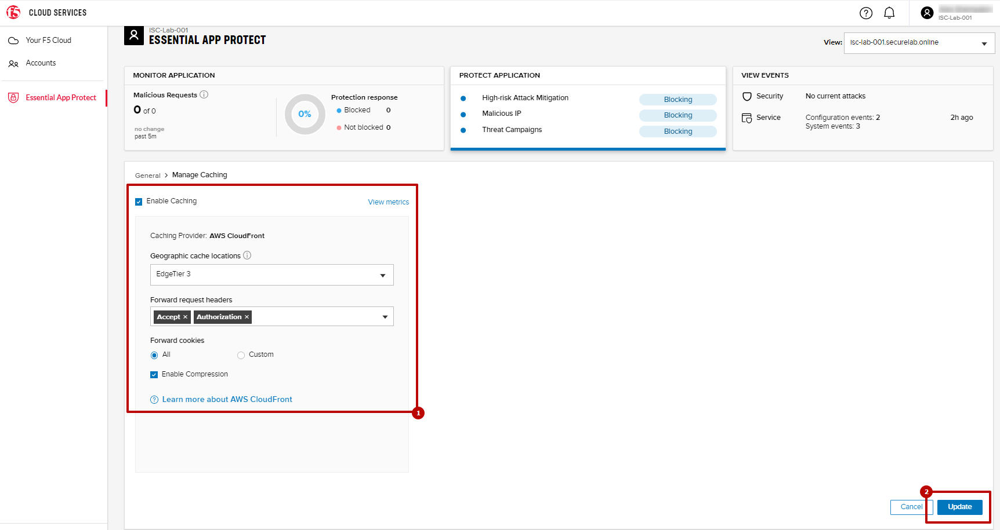

The feature will be deployed in few minutes
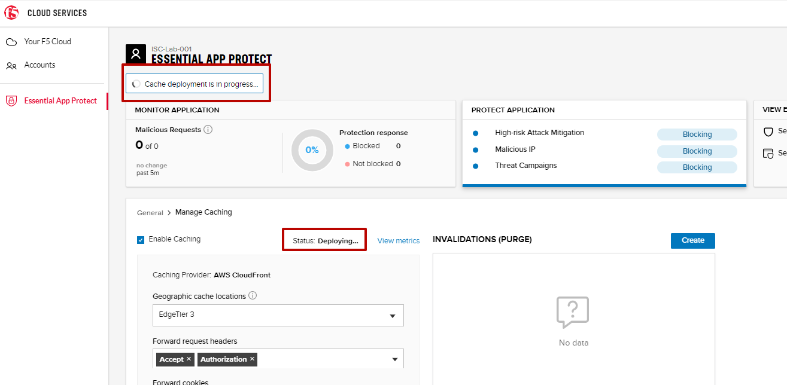

You will see "Deployed" status on the main page
.. figure:: _figures/cloudfront_setup_ready.png

TODO: TEST CLOUDFRONT ???