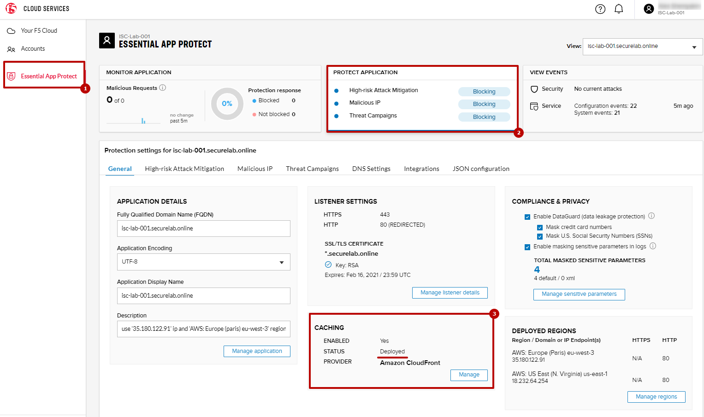

LAB: Lab description here
==================================================

.. contents:: Table of Contents

1. Accept the Invite
************************************************************************
In order to test geo-proximity rules, you can use your own VPN service (if you have one), remote desktop to a VM in a different region (if you have one), or alternatively use the Opera browser as described below.

`a)` Open the Opera browser, click **Settings**, **Advanced**, **Features** and then **Enable VPN**.

.. figure:: _figures/opera_setup.png

`b)` In your email, accept the invite we sent you.

.. figure:: _figures/invite.png

`c)` Go to the F5 Cloud Services Portal and click on the username icon in the top right corner and switch account to the ISC-Lab-xxx (where xxx is your unique id which can be found in the invite).

.. figure:: _figures/switch_account.png

`d)` Go to the Essential App Protect tab and find your application. We have pre-created it for you. The application name is isc-lab-xxx.securelab.online where xxx is your unique id.

.. figure:: _figures/open_the_app.png

2. Simulate SQL Injection Attack
************************************************************************

SQL Injection attack inserts a SQL query via the input data field in the web application. Such attacks could potentially read sensitive data, modify and destroy it. More detailed information can be found `here <https://bit.ly/2ZUv0Xl>`_.

Let's now follow the steps below to simulate SQL Injection attack via browser and our "BuyTime Auction" app. 

`a)` Copy your FQDN from the F5 Cloud Services Portal and paste it to your browser. In the **LOG IN** window fill in username value as follows (including single quotes) **' OR 1=1 --'** and use any password as the value. Click **LOGIN**.

.. figure:: _figures/sql_attack_not_blocked.png

`b)` Go back to the F5 Cloud Services Portal, the **High-risk Attack Mitigation** tab and toggle **Blocking Mode** on.

.. figure:: _figures/sql_attack_turn_on.png

`c)` And now simulate the attack again by repeating the step **a)** above. This time it will be blocked by Essential App Protect.

.. figure:: _figures/sql_attack_blocked.png

You can find detailed event log in the events stream in the F5 Cloud Services Portal, the **VIEW EVENTS** card. 

.. figure:: _figures/sql_attack_events_stream.png

3. Add an Additional Endpoint
************************************************************************

For now our app has only one endpoint located in Asia Pacific (Sydney) and deployed on Amazon AWS. But our application is serving a global audience, so let's add the second endpoint located in Europe for European users.

`a)` Go to the F5 Cloud Services Portal, the **PROTECT APPLICATION** card. There, in the **Description** field of the **General** tab, you can find the information required for the second region.

.. figure:: _figures/info_in_description.png

`b)` Select **Manage regions**.

.. figure:: _figures/manage_regions.png

`c)` Hit **Add** to add the new region:

.. figure:: _figures/add_region.png

`d)` Fill in the region details with the information found in the **Description** field above and **Save** the settings.

.. figure:: _figures/add_region_details.png

The application will be deployed to the second region. It will take several minutes to complete.

.. figure:: _figures/add_region_deploying.png

When the app is deployed, you will see the **Active** state indicator.

.. figure:: _figures/add_region_active.png

**TODO: UPDATE SCREENSHOT**
You can also track regions on the interactive map. Go to the **MONITOR APPLICATION** card where you can see that both endpoints are shown on the map. 

.. figure:: _figures/add_region_map.png

`e)` Now let’s test the protected app, as well as the multi-region support using the Opera browser. As you remember, we now have two endpoints for users in Asia Pacific and Europe, so we'll test those two locations. Keep in mind that Essential App Protect uses performance-based routing to determine the closest endpoint to drive the users to.

Open the Opera browser, click **VPN** and first select **Asia**. This will simulate your entering the test app (BuyTime Auction) from the Asian region. Then copy FQDN name in Load balanced record properties and paste into the browser. You will get to that IP endpoint which is located in Asia Pacific (Sydney).

**TODO: UPDATE SCREENSHOT**

.. figure:: _figures/opera_america.png

`f)` And now select **Europe** in **VPN** of the Opera browser and **Reload** the page. You will get to the European IP endpoint, which means that European users are directed to that IP Endpoint.

**TODO: UPDATE SCREENSHOT**

.. figure:: _figures/opera_europe.png

4. Enable CloudFront Caching
************************************************************************

Caching in Essential App Protect allows you to work with Amazon CloudFront that delivers content globally by caching it in different locations around the world. Now let's deploy caching and use CloudFront as caching provider. 

`a)` Go back to the F5 Cloud Services portal, **Essential App Protect**, the **PROTECT APPLICATION** card and hit **Manage** for **CACHING**.

.. figure:: _figures/cloudfront_setup.png

`b)` Check **Enable Caching**, select **EdgeTier 3** which uses all edges and provides the best performance, add **Accept** and **Authorization** headers forwarding, forward **all** cookies and click the **Update** button.

.. figure:: _figures/cloudfront_setup_details.png

The feature will be deployed in a few minutes.

.. figure:: _figures/cloudfront_setup_deploying.png

You will see **Deployed** status on the main page.

TODO: TEST CLOUDFRONT ???
